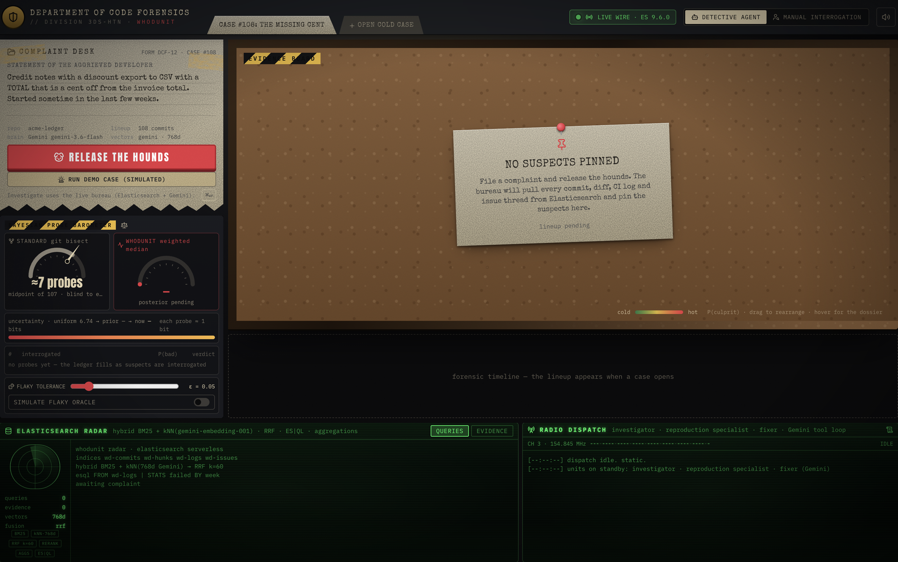
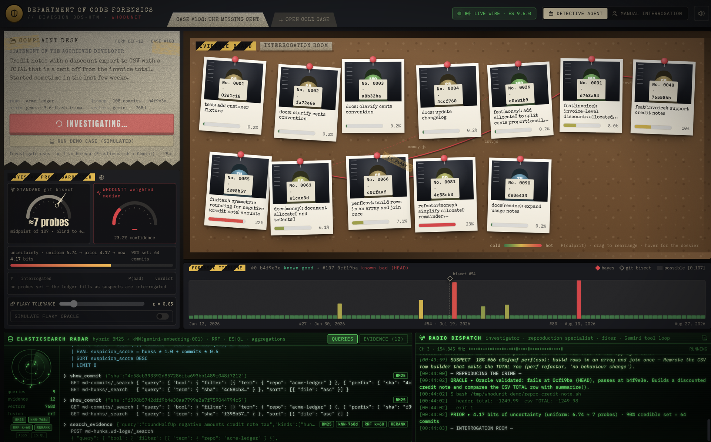
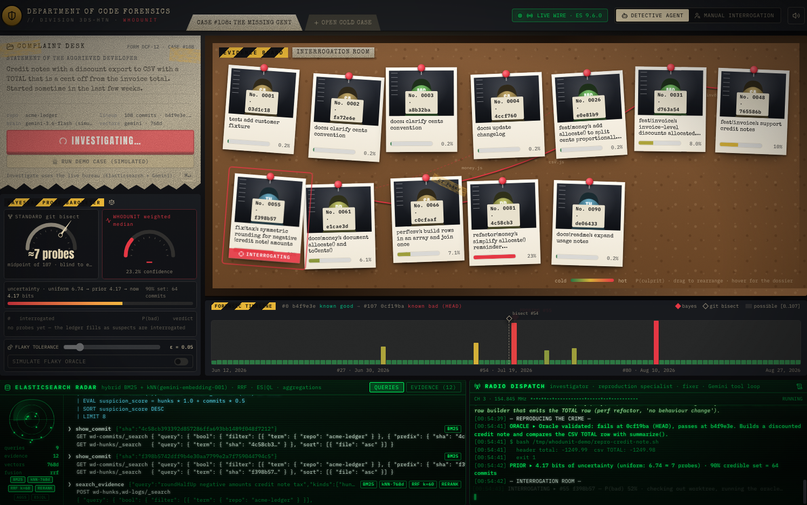
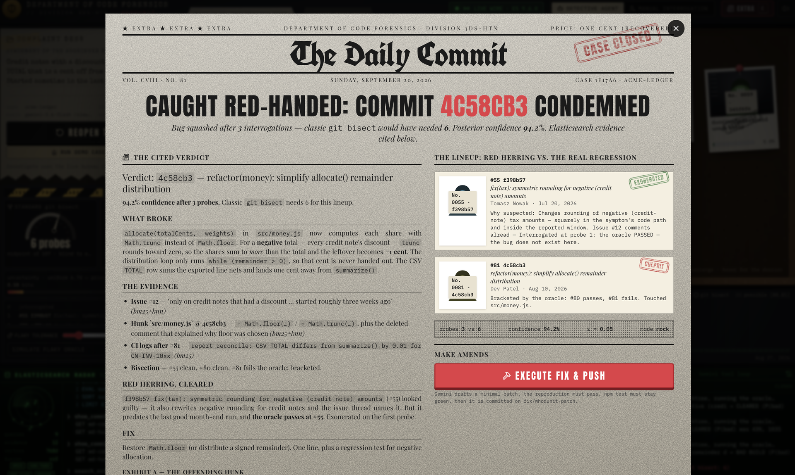

# Whodunit

Git bisect with a brain. Pronounced **who-DUNN-it**.

Solo project. You type what broke. It searches git history in Elasticsearch, writes a test, and finds the culprit with a Bayesian bisect (usually fewer runs than `git bisect`). Gemini writes a cited verdict and can commit a fix.

Built at [Hack the North 2026](https://hackthenorth.com)

## The Problem

`git bisect` treats every commit as equally suspicious and trusts the test every time. That is a slow midpoint search, and a single flake can blame an innocent commit. The commit that *looks* guilty is often a red herring (the feature, the tax rounding "fix"). I wanted a bisect that reads the diffs, CI logs, and issue threads first, then splits probability, and still works when the test lies.

## How it works

1. **File the complaint.** One sentence on the manila desk. Prefill is the missing-cent CSV. **Run demo case (simulated)** is the 30 second pitch (no live APIs). **Release the hounds** hits live Elasticsearch + Gemini.

   

2. **Search the case file.** Hybrid BM25 + Gemini 768-d kNN, fused with RRF, over four messy indices (commits, hunks, CI logs, issues). ES|QL on the radar. Polaroids heat up with the posterior, not vibes.

   

3. **Bisect belief.** Grey needle is classic git bisect (midpoint). Red needle is the weighted median of the posterior. Probes run in git worktrees. Flip **simulate flaky oracle** and vanilla bisect derails; this one still closes.

   

4. **Name the killer.** The Daily Commit EXTRA cites `4c58cb3`: `Math.floor` became `Math.trunc`, so negative money (credit notes) rounds the wrong way. One cent. Gemini can restore `Math.floor` and push if the repro and `npm test` stay green.

   

Demo crime scene: `acme-ledger`, 108 commits, green test suite. The credit-note feature is the red herring.

## Architecture


## Tech Stack

| Layer | Technology | Why |
|-------|-----------|-----|
| Search | Elasticsearch 9 (Elastic Cloud Serverless) | Hybrid BM25 + kNN + RRF over dirty diffs, CI, issues. ES|QL for timelines. |
| Brain | Gemini (Flash + embeddings) | Three tool-calling jobs: investigate, reproduce, fix. Quota fallback so a 429 does not kill the pitch. |
| Math | TypeScript Bayesian bisect | Weighted-median probe, ε-noise, bracket stop. Same engine in Node and in the browser sim. |
| Oracle | git worktrees | Checkout a commit, run the repro, update the posterior. |
| UI | React 19, Vite, Tailwind 4, Framer Motion | Interrogation room over SSE: cork board, radar, barometer, newspaper. |
| Offline | Simulated case | Real acme-ledger history replayed in the browser if Wi-Fi or APIs die. |

## Getting Started

### Prerequisites

- Node 20+
- `ELASTICSEARCH_URL` + `ELASTICSEARCH_API_KEY` (Elastic Cloud Serverless is fine)
- `GEMINI_API_KEY`

Simulation still runs if Elasticsearch is down.

### Play (the UI)

```bash
npm install
cp .env.example .env
npm run play
```

Open **http://127.0.0.1:3333** (fullscreen, or 1512×945).

```bash
npm run demo:offline    # force simulation
npx whodunit doctor     # check ES + Gemini
```

First run generates and indexes `acme-ledger` if needed.

### CLI (same engine)

```bash
npx whodunit demo generate
npx whodunit index --repo /tmp/whodunit-demo/acme-ledger
npx whodunit solve --repo /tmp/whodunit-demo/acme-ledger \
  "Credit notes with a discount export to CSV with a TOTAL that is a cent off from the invoice total." \
  --fix --verify "npm test"
```

No Gemini key? Pass your own test:

```bash
npx whodunit solve --repo /tmp/whodunit-demo/acme-ledger "credit note csv total off by a cent" \
  --test "bash /tmp/whodunit-demo/repro-credit-note.sh"
```

---

Built at Hack the North 2026. MIT.
